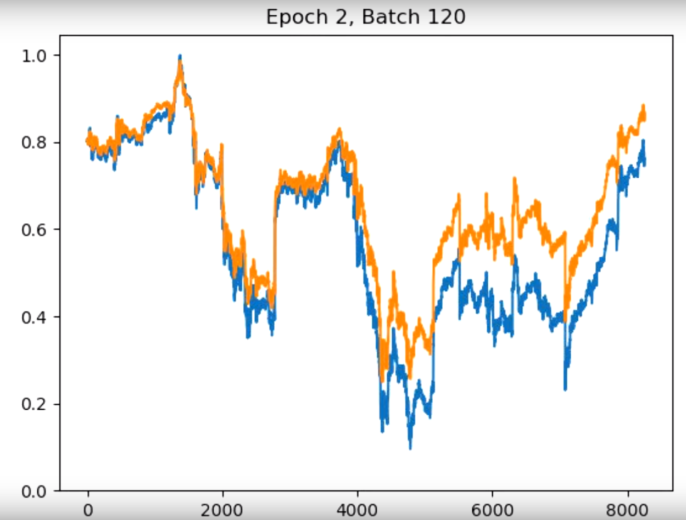

# Python-Applications

# Stock Price Prediction Project: A simple deep learning model for stock prediction using TensorFlow! 

In Progress: I will soon add the weight of news to the model to predict more accurate predictions. 
If you would like to collaborate on this please email me at sagar11@icloud.com! 

This repository contains the Python script as well as the source dataset. 

The dataset is zipped due to Github's file size restrictions.Be sure to unzip the dataset and have the TensorFlow library installed using pip! 

